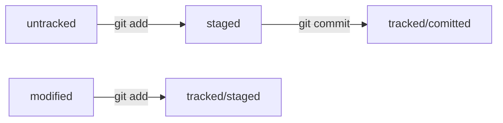

# Настройка окружения и знакомство с командной строкой

## Знакомство с Git

1. Система контроля версий, или VCS (SCM), — программа, позволяющая контролировать изменения в проекте.
2. Git — один из примеров системы контроля версий: он позволяет хранить, изменять и анализировать историю проекта.
3. Git — незаменимый в команде инструмент, ведь он помогает объединять результаты работы нескольких человек.

## Командная строка

1. Консольные и графические интерфейсы — два способа взаимодействия с программами.
2. Консоль, терминал, или командная строка, — это программа, которая считывает команду пользователя и выполняет её.

### Основные команды консоли:

1. Чтобы вывести текущую рабочую директорию, можно использовать команду ```pwd```.
2. У большинства пользователей компьютера есть доступ к домашней директории. Чтобы к ней перейти, используют команду ```cd ~```.
3. ```ls``` - вывести содержимое директории
4. ```ls -a``` - просмотреть содержимое дириктории вместе со скрытыми файлами.
5. ```touch``` - создание нового файла.
6. ```mkdir``` - создание новой дириктроии. Флаг ```-p``` позволяет создать целую структуру дирикторий.
7. ```cp``` - копирование файла (-ов).
8. ```mv ``` - перемещение файла (-ов).
9. ```rm``` - удаление файла (-ов).
10. ```rmdir``` - удаление дириктории.
11. ```rmdir -r``` - удаление дириктории со всем её содержимым.
12. ```сat``` - вывод содержимого файла.

### Эфективная работа с командной строкой.

1. С помощью ```&&``` можно выполнить несколько команд сразу — одну за другой.
2. Команды, которые вы выполняете в консоли, попадают в историю. Вы можете перемещаться по этой истории при помощи стрелок ```↑↓```.
3. При нажатии на ```Tab``` консоль предложит несколько вариантов продолжения команды.
4. Символами ```/``` и ```~``` можно быстро перемещаться к корневой и домашней директориям.

## Настройка Git

После установки системы Git на локальный компьютер необходимо сделать базовые настройки.

1. ```git -v``` - позволяет проверить версию git.
2. Чтобы участникам проекта было понятно, кто и какие изменения вносил, нужно представиться и указать имя пользователя и адрес электронной почты. Это делается следующими командами:
```
$ git config --global user.name "ваше имя или ник латиницей" 
$ git config --global user.email ваша электронная почта 
```
3. ```git config --list ``` - позволяет проверить текущие настройки.

## Шпаргалка Git

1. ```git init``` - инициализировать репозиторий в текущей дириктории.
2. ```git status``` - проверить состояние репозитория.
3. Если вы ошиблись и случайно инициализировали не ту папку, можно «разгитить» её — удалить скрытую подпапку ```.git```.
4. ```git add``` - позволяет подготовить файл к сохранению.
5. ```git add --all``` - подготовит к сохранению сразу все файлы.
6. ```git add .``` - добавить в репозиторий текущую папку со всеми файлами.
7. ```git commit -m``` - фиксация изменений с комментарием.
8. ```git log``` - история коммитов.

# Знакомство с GitHub

1. GitHub — платформа, которая работает с Git и упрощает командное взаимодействие.
2. Кроме GitHub, существуют и другие подобные платформы, например GitLab, Bitbucket и так далее.
3. Git — это консольный инструмент для работы с локальными и удалёнными репозиториями. Он не связан напрямую ни с одной из платформ и развивается отдельно от них.

Для правильной работы с удаленным репозиторием необходимо зарегистрироваться на платформе GitHub и сгенерировать ключ SSH. Он обеспечит безопасный обмен данными с удаленным репозиторием.

##Генерация ключа SSH.

1. ```ssh-keygen -t ed25519 -C "электронная почта, к которой привязан ваш аккаунт на GitHub"```
2. ```ls -a ~/.ssh ``` - проверка ключей.

## Привязка SSH-ключа к GitHub.

1. На своей страничке GitHub выберите пункт Settings (англ. «настройки») в меню аккаунта.
2. В меню слева нажмите на пункт **SSH and GPG keys**.
3. В открывшейся вкладке выберите **New SSH key** (англ. «новый SSH-ключ»).
4. В поле Title (англ. «заголовок») напишите название ключа. Например, **Personal key** (англ. «личный ключ»).
5. В поле Key type (англ. «тип ключа») должно быть **Authentication Key** (англ. «ключ аутентификации»).
6. В поле **Key** скопируйте ваш ключ из буфера обмена.
7. Нажмите на кнопку **Add SSH key** (англ. «добавить SSH-ключ»).
8. ```ssh -T git@github.com ``` - проверка правильности ключа.

## Привязка локального и удаленного репозиториев.

1. На своей страничке GitHub создаем новый репозиторий.
2. Перейдите на страницу удалённого репозитория, выберите тип ```SSH``` и скопируйте ```URL```. Кнопка справа позволит сделать это мгновенно.
3. ```git remote add origin git@github.com:%ИМЯ_АККАУНТА%/first-project.git ``` - команда позволяет связать локальный и удаленный репозитории.
4. ```git remote -v``` - проверка настроек.

## Синхронизация локального и удаленного репозиториев.

1. Коммиты хранятся в ветках. Начальная ветка создаётся автоматически и называется **main** или **master**.
2. За отправку изменений на удалённый репозиторий отвечает команда ```git push```.
3. Интерфейс GitHub позволяет удобно просмотреть все коммиты в репозитории, а также изменения в этих коммитах.
4. В корне проекта принято создавать файл readme.md с его подробным описанием.

# Навигация по коммитам.

## Хеш — идентификатор коммита.

1. Git преобразует информацию о коммитах с помощью алгоритма SHA-1 и для каждого из них рассчитывает уникальный идентификатор — хеш.
2. Хеш — основной идентификатор коммита и позволяет узнать его автора, дату и содержимое закоммиченных файлов.
3. Все хеши, а также таблицу соответствий ```хеш → информация``` о коммите Git хранит в папке ```.git```.

## Статусы файлов.

1. ```git log --oneline``` - получить сокращенный лог.
2. В числе прочих файлов в папке ```.git``` есть служебный файл ```HEAD```. Он указывает на самый свежий коммит.
3. Вместо хеша последнего коммита можно написать слово ```HEAD``` — Git вас поймёт.

### Основные статусы файлов в Git.

1. Новые файлы в Git-репозитории помечаются как **untracked** (англ. «неотслеживаемый»), то есть неотслеживаемые. Git «видит», что такой файл существует, но не следит за изменениями в нём. У untracked-файла нет предыдущих версий, зафиксированных в коммитах или через команду ```git add```.
2. **staged** (англ. «подготовленный»). После выполнения команды ```git add``` файл попадает в ```staging area``` (от англ. stage — «сцена», «этап [процесса]» и area — «область»), то есть в список файлов, которые войдут в коммит. В этот момент файл находится в состоянии staged.
3. **tracked** (англ. «отслеживаемый») — это противоположность untracked. Оно довольно широкое по смыслу: в него попадают файлы, которые уже были зафиксированы с помощью ```git commit```, а также файлы, которые были добавлены в ```staging area``` командой ```git add```. То есть все файлы, в которых Git так или иначе отслеживает изменения.
4. **modified** (англ. «изменённый») означает, что Git сравнил содержимое файла с последней сохранённой версией и нашёл отличия. Например, файл был закоммичен и после этого изменён.

## Схема статусов файлов


# Как исправить коммит?

1. Дополнить коммит новыми файлами можно с помощью ```git commit --amend --no-edit```. Благодаря опции ```--no-edit``` сообщение к коммиту останется таким, каким и было.
2. ```--amend``` рассчитан на работу с последним коммитом ```(HEAD)```.
3. Изменить сообщение к коммиту позволяет команда ```git commit --amend -m``` "Обновлённое сообщение коммита".

# Как откатиться назад?

1. ```git restore --staged <file>``` переведёт файл из ```staged``` обратно в ```modified``` или ```untracked```.
2. ```git reset --hard <commit hash>``` «откатит» историю до коммита с хешем ```<hash>```. Более поздние коммиты потеряются!
3. ```git restore <file>``` «откатит» изменения в файле до последней сохранённой (в коммите или в ```staging```) версии.